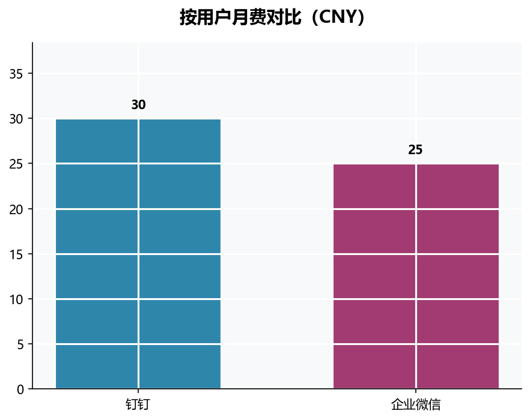

# Dreamcode — AI 竞品分析平台

多智能体协同驱动的竞品分析工具：输入目标产品名称，自动完成竞品采集、情感分析、横向对比，生成专业 PDF 报告。

---

## 技术栈

| 层 | 技术 |
|---|---|
| 后端流程编排 | LangGraph 0.2+ |
| Web 服务器 | FastAPI + Uvicorn |
| LLM（规划/报告） | GPT-5（OpenAI 兼容） |
| LLM（采集/分析） | DeepSeek V4 Pro |
| LLM（仲裁/终审） | 豆包（火山方舟 Ark） |
| 联网搜索 | Tavily Search API |
| 情感分析 | BERT + transformers |
| 报告渲染 | WeasyPrint（Linux/Mac）/ ReportLab（Windows）|
| 前端 | Vanilla JS + HTML/CSS（无框架） |

## 目录结构

```
Dreamcode/
├── app/                    # Web 层
│   ├── server.py           # FastAPI 入口（5 个端点 + SSE）
│   ├── index.html          # 单页前端
│   └── static/             # CSS / JS
├── src/cca/                # 核心 Python 包
│   ├── agents/             # PM / Collector / Insight / Reporter
│   ├── tools/              # 搜索 / 图表 / PDF / AppStore 等工具
│   ├── skills/             # Debate / Reroute / BERT 微调等可复用技能
│   ├── llm/                # LLM 客户端工厂与运行时 Key 注入
│   ├── prompts/            # Agent system prompts（Markdown）
│   ├── graph.py            # LangGraph 主图编排
│   ├── schema.py           # Pydantic 领域模型
│   └── state.py            # LangGraph 共享状态（TypedDict）
├── scripts/                # 开发脚本
│   ├── run_server.py       # 启动 FastAPI 服务器
│   ├── demo/               # 离线 dry-run / demo 运行
│   └── ...                 # 其他调试脚本
├── tests/                  # 单元测试（pytest）
├── docs/                   # 架构文档 / 决策记录
├── config/config.yaml      # 模型定价 / 任务参数等配置
└── data/                   # 运行时数据（上传文件 / 缓存 / BERT 数据）
```

---

## 快速开始

### 环境要求

- Python 3.11+
- Node.js 18+（仅 AppStore 爬虫脚本需要）

### 安装

```bash
git clone https://github.com/StooneJam/Dreamcode.git
cd Dreamcode

# 安装 Python 依赖
pip install -e ".[dev]"

# 配置环境变量
cp .env.example .env
```

编辑 `.env`，填入以下 Key（离线 demo 模式必填，前端注入模式可选）：

```env
OPENAI_API_KEY=sk-...
OPENAI_MODEL=gpt-5

DEEPSEEK_API_KEY=sk-...
DEEPSEEK_MODEL=deepseek-v4-pro
DEEPSEEK_BASE_URL=https://api.deepseek.com

DOUBAO_API_KEY=...
DOUBAO_MODEL=ep-20260514111325-xjmj7
DOUBAO_BASE_URL=https://ark.cn-beijing.volces.com/api/v3

TAVILY_API_KEY=tvly-...
```

### 启动服务器

```bash
python scripts/run_server.py
# 默认监听 http://localhost:8000
# 可指定端口：python scripts/run_server.py --port 8080
```

浏览器打开 `http://localhost:8000` 即可使用前端界面。

### 离线 Demo（不启动服务器）

```bash
# 完整流程 dry-run（使用 .env Key）
python scripts/demo/dry_run.py

# 仅跑 Reporter（已有 profiles 数据时）
python scripts/run_report_agent.py
```

---

## 使用指南

### 通过 Web 界面

1. 在「开始分析」表单填写目标产品名称和分析需求（可选上传参考文档 PDF/Word）
2. 点击「开始分析」后配置 API Key：

   | 槽位 | 对应 Agent | Key 来源 |
   |---|---|---|
   | GPT-5 槽位 | PM Agent · Reporter | OpenAI 或兼容接口 |
   | DeepSeek 槽位 | Collector · Insight | DeepSeek API |
   | Doubao 槽位 | Debate Judge · 终审 | 火山方舟 Ark |

   Tavily Search Key 必填（[免费申请](https://app.tavily.com)）。三个 AI 槽位至少填一个，填多个不同厂商的 Key 可启用跨模型协作。

3. 提交后日志面板实时展示 Agent 运行状态，完成后 PDF 报告自动展示在右侧。

### 通过 Python API 直接调用

```python
from cca.graph import build_graph, empty_state
from cca.llm.factory import LLMCredential, use_credentials
from cca.tools.search import use_tavily_key

graph = build_graph(checkpointer=None)
state = empty_state(
    user_query="分析飞书与钉钉、Slack 的视频会议功能差异和定价策略",
    target_product="飞书",
)

creds = {
    "gpt-5":    LLMCredential(api_key="sk-...", model="gpt-5"),
    "deepseek": LLMCredential(api_key="sk-...", model="deepseek-v4-pro",
                              base_url="https://api.deepseek.com"),
}

with use_credentials(creds):
    with use_tavily_key("tvly-..."):
        result = graph.invoke(state)

print(result["report_pdf_path"])
```

---

## 项目截图 / Demo

> 完整运行演示 GIF 待补充

报告样本图表：

| 雷达图（维度竞争力） | 双轴柱状图（评分 vs 评论量） | 定价对比 |
|---|---|---|
|  |  |  |

---

## 核心特性

- **四 Agent 流水线**：PM 制定计划 → Collector 联网深采集 → Insight BERT 情感分析 → Reporter 生成报告，全程 LangGraph 自动编排
- **跨模型辩论（Debate）**：PM 规划、报告终审阶段引入多家族 LLM 相互质疑，减少单一模型自我偏好
- **人在环审查（Human-in-the-Loop）**：Collector + Insight 完成后暂停，用户可提交自由文本修订意见，PM 自动解析并重新规划
- **运行时 Key 注入**：每次分析使用用户自己的 API Key，服务器不存储任何凭证，通过 `contextvars` 线程安全传递
- **信号路由 / 自动重跑**：Agent 发现数据缺口时向 PM 发 Signal，触发定向补采，最多 2 轮防死循环
- **SSE 流式日志**：分析过程实时推送到前端，工具调用、思考过程、PM 评审结果逐步可见
- **专业 PDF 报告**：包含 SWOT 分析、维度竞争力雷达图、App Store 评分双轴对比、定价横向比较、用户评价主题汇总

---

## 鸣谢与联系方式

- [LangGraph](https://github.com/langchain-ai/langgraph) — 多 Agent 图编排框架
- [FastAPI](https://fastapi.tiangolo.com) — 异步 Web 框架
- [Tavily](https://tavily.com) — 专为 AI Agent 设计的搜索 API
- [DeepSeek](https://deepseek.com) / [OpenAI](https://openai.com) / [ByteDance Doubao](https://www.volcengine.com/product/doubao)

**团队**：StooneJam · BAbykiller322

Issues 与建议请提交至 [GitHub Issues](https://github.com/StooneJam/Dreamcode/issues)。
